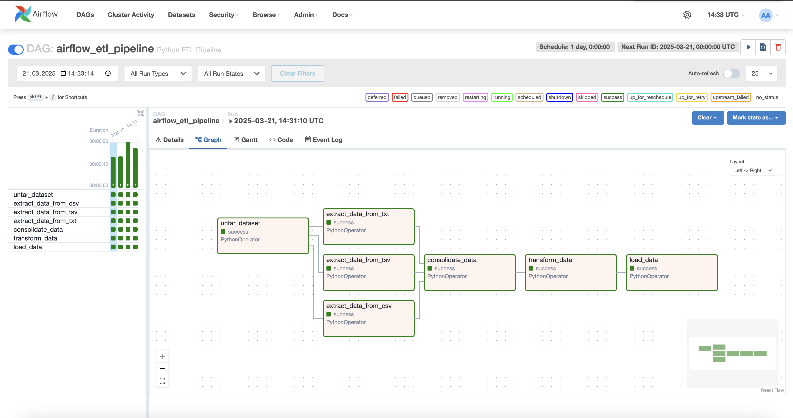
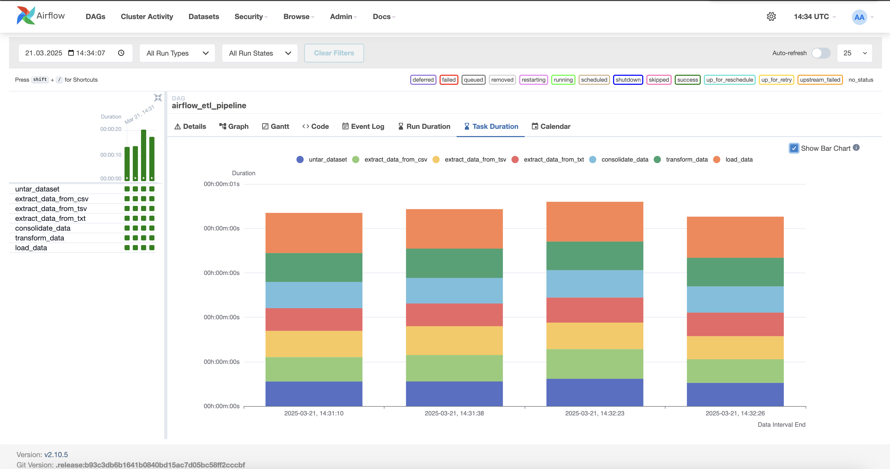
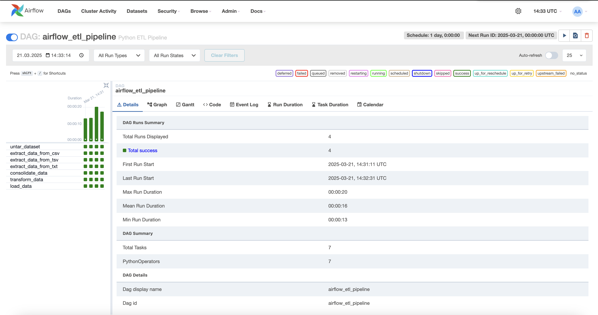
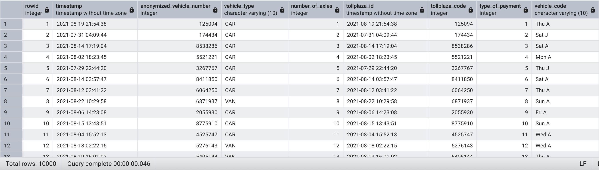

# Airflow ETL Pipeline

This project implements a fully automated ETL pipeline based on Apache Airflow and Python, designed to streamline data extraction from multiple file sources, transform it according to specific requirements and loads it into a PostgreSQL database. The pipeline handles various file formats ensuring efficient data processing and seamless integration into a centralized database for further analysis.

# Tasks  
  1. Untar: Extracts the content of 'tolldata.tgz' that is containing the datasets.
  2. Extraction process consists of 3 different extraction tasks for each file format (.csv, .tsv, .txt) and organizes the data into relevant structures.
  3. Combines the extracted data and consolidates into an unified output format. 
  4. Transforming process involves changing columnar data formats.
  5. The load function employs an in-memory buffer (StringIO) to load the transformed dataset into PostgreSQL db. This minimizes disk I/O and enhances performance by streaming the data from memory to the database.

# Key features
  - Batch Processing: Efficiently handling large datasets by grouping data operations into scheduled workflows. 
  - Automation: Fully automated ETL pipeline that runs on a scheduled basis (daily).
  - Scalability: Easily adaptable for processing larger datasets by adjusting the schedule or task configuration.
  - Data Transformation: Data extraction, consolidation and transformation into a unified format ready for storage.
  - PostgreSQL Integration: Loads processed data into PostgreSQL for easy access and future analytics.

# Screenshots

