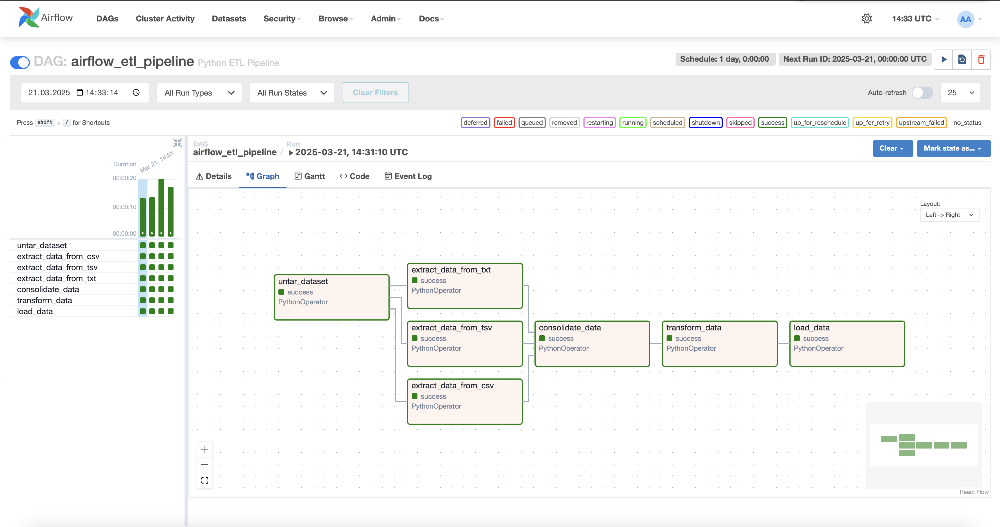
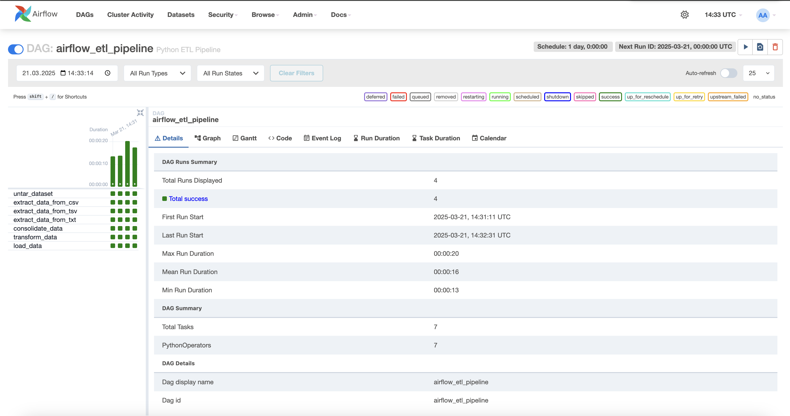
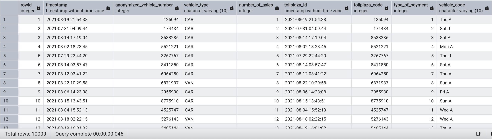

# Airflow ETL Pipeline

This project implements a fully automated ETL pipeline using Apache Airflow and Python, designed to streamline data extraction from multiple file sources, transform it according to specific requirements and load it into a PostgreSQL database. The pipeline handles various file formats ensuring efficient data processing and seamless integration into a centralized database for further analysis.

# Tasks:  
  1. Untar: The first task extracts the contents of a .tgz file containing the datasets.
  2. Extraction process consists of 3 different extraction tasks for each file format (.csv, .tsv, .txt) and organizes the data into relevant structures.
  3. Combines the extracted data and consolidates into a unified output format. 
  4. Transforming process involves changing columnar data formats.
  5. Loads the transformed dataset into a PostgreSQL database, ensuring seamless data integration and storage.

# Key features
  - Automation: Fully automated ETL pipeline that runs on a scheduled basis (daily).
  - Scalability: Easily adaptable for processing larger datasets by adjusting the schedule or task configuration.
  - Data Transformation: Data extraction, consolidation, and transformation into a unified format ready for storage.
  - PostgreSQL Integration: Loads processed data into PostgreSQL for easy access and future analytics.
    

